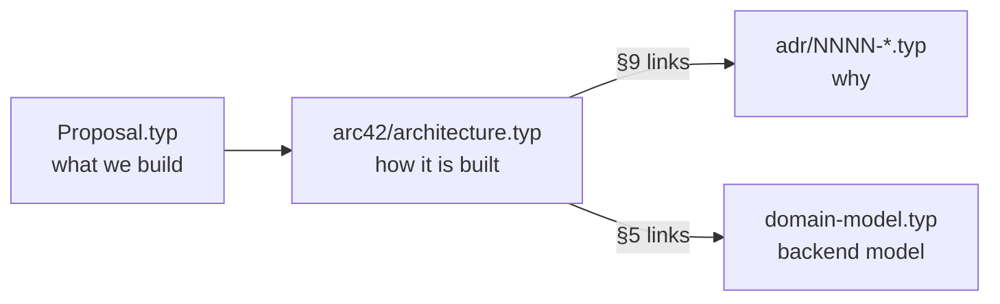

# Documentation



| File | Content |
| --- | --- |
| `Proposal.typ` | Scope, user stories, MoSCoW |
| `arc42/architecture.typ` | Architecture (arc42). Sections in `arc42/sections/` |
| `domain-model.typ` | Contexts, aggregates, rules, ports, events |
| `adr/NNNN-*.typ` | One decision per file. New ADR: copy the header from `adr/template.typ` |
| `work-journal.typ` | Hours log |

## Decisions

| ADR | Decision |
| --- | --- |
| 0001 | One repo, one backend process |
| 0002 | DDD + hexagonal modules, async event bus |
| 0003 | nginx serves the SPA and proxies `/api` |
| 0004 | PostgreSQL for metadata, audio behind `FileStorage` |
| 0005 | Keycloak (OIDC), session cookie, owner-scoped queries |
| 0006 | Generated OpenAPI client, TanStack Query |
| 0007 | Presentational/container split, max two re-emits |

## Build

All diagrams are Mermaid, rendered by the Typst package `@preview/merman`
(downloaded on first compile).

```bash
typst compile arc42/architecture.typ
typst compile domain-model.typ
for f in adr/0*.typ; do typst compile "$f"; done
```
